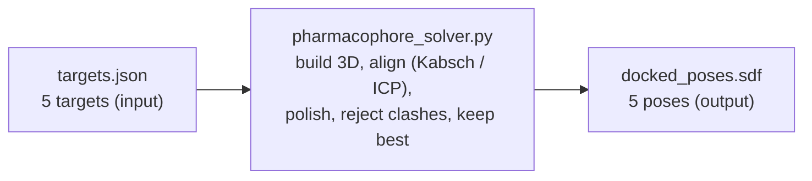

# geometric-pharmacophore-alignment

[](https://github.com/Sebuliba-Adrian/geometric-pharmacophore-alignment/actions/workflows/ci.yml)
[](https://github.com/Sebuliba-Adrian/geometric-pharmacophore-alignment/actions/workflows/ci.yml)
[](https://www.python.org/downloads/)
[](https://github.com/astral-sh/ruff)
[](Dockerfile)

Dock each ligand (from a SMILES string) into a pocket defined by pharmacophore
interaction sites and excluded-volume spheres, and write the best clash-free pose
per target to a single SDF.

The whole solution is one file: `pharmacophore_solver.py`.

## Input and output (the black box)



**In** - `/root/data/targets.json`, describing 5 targets. Each target has:
- `smiles`: the molecule as a flat text recipe (atoms + bonds, no 3D coordinates),
  e.g. ibuprofen `CC(C)Cc1ccc(cc1)C(C)C(O)=O`.
- `interaction_sites`: points the molecule should touch, each with a `family`
  (Donor / Acceptor / Hydrophobe / Aromatic), an `(x, y, z)` position, and a
  `weight` (how much that site matters).
- `excluded_volumes`: "no-go" spheres, each an `(x, y, z)` center and a `radius`
  (1.2 A), that no atom may enter.

In words: *here is a molecule, here are the spots it should hit, and here are the
regions it must avoid.*

**Out** - `/root/results/docked_poses.sdf`, one molecule record per target in the
same order. Each record holds the molecule's atoms with their **3D (x, y, z)
coordinates** (this is the docked pose), its bonds (same topology as the input
SMILES, heavy atoms only), and the target name.

In words: *for each molecule, the 3D position of every atom in its best-fitting,
clash-free pose.* The grader reads these coordinates, recomputes the score, and
checks for clashes.

**Why an SDF?** SDF (Structure-Data File) is the standard cheminformatics format
for storing molecules with 3D coordinates plus per-molecule data, one record per
molecule separated by `$$$$`. It is what docking tools emit and what viewers
(PyMOL, ChimeraX) and scoring pipelines read, so it is the natural way to hand
back a set of poses. We write it with RDKit's `SDWriter`; it reads back with
`SDMolSupplier` (a test does exactly that and re-scores the file to confirm the
written coordinates reproduce the reported score). A plain `.xyz` would lack bonds
and metadata, and a SMILES string has no 3D coordinates, so neither would do.

## Setup

```bash
uv venv --python 3.11 .venv
uv pip install --python .venv/bin/python -r requirements.txt
```

## Run

```bash
# grader paths are the defaults (/root/data/targets.json -> /root/results/docked_poses.sdf)
.venv/bin/python pharmacophore_solver.py

# local run with explicit paths
TARGETS_JSON=~/Downloads/targets.json OUTPUT_SDF=./out.sdf \
    .venv/bin/python pharmacophore_solver.py
```

### Docker

```bash
docker build -t pharmacophore .
docker run --rm -v "$PWD/data:/root/data" -v "$PWD/results:/root/results" pharmacophore
```

## Test

```bash
.venv/bin/python -m pytest -q          # 25 tests
```

## Results

Score = achieved / max-possible (`sum of site weights`); every pose is clash-free,
and each reported score is verified to equal the score of the emitted SDF molecule
(features re-perceived on the output), so this is what a grader sees.

| target | molecule | score |
|--------|----------|-------|
| target_1 | ibuprofen | 89.0% |
| target_2 | caffeine | 48.7% |
| target_3 | aspirin | 67.5% |
| target_4 | imatinib-like | 66.1% |
| target_5 | gefitinib-like | 65.3% |
| **total** | | **66.2%** |

## Approach

`SMILES -> 3D conformers (RDKit ETKDG) -> per-family feature atoms ->
correspondence seed + weighted Kabsch + ICP refine -> scipy polish on the true
weighted-Gaussian score -> reject clashes -> best pose per target (best of several
deterministic seeds) -> SDF.`

Kabsch is exact for a fixed feature-to-site correspondence; ICP refines a pose to a
*locally stable* nearest-neighbour correspondence by alternating nearest-assignment
and Kabsch (it is not guaranteed to be the best correspondence); the polish then
optimises the true (weighted, saturating) objective that Kabsch's RMSD only
approximates. The polish adds a smooth penalty that *discourages* clashes; a final
hard clash check is what *guarantees* every emitted pose is clash-free.

**Where the maths is worked out:** to follow most of the maths, read the docstrings
in `pharmacophore_solver.py` - each function carries a short, concrete example
(distance as 3D Pythagoras, the Gaussian score with numbers, the clash threshold, the
rotation as a matrix times a vector, the calculus behind the polish, and why it uses
the derivative-free Nelder-Mead optimiser). Key terms are defined in the
[Glossary](#glossary).

## How the approach evolved

Each stage was kept until a concrete limitation forced the next one. These are the
development steps and the reasoning behind them; the final, reproducible score per
target is in the Results table above (the intermediate per-stage numbers from
development are not reproducible from this repo, so they are omitted).

1. **Brute force.** Generate conformers, then slide and spin the molecule across a
   grid of positions and orientations, score each placement, keep the best clash-free
   one.
   *Abandoned because:* the search is 6-dimensional (3 for position, 3 for
   orientation). A grid fine enough to land features on the sites is astronomically
   large, while an affordable grid is far too coarse to align well. Searching the
   pose space directly cannot win here.

2. **Kabsch from correspondences.** Stop searching rotations: once you decide which
   feature atom should sit on which site, Kabsch returns the optimal rotation and
   translation in a single closed-form step.
   *Abandoned because:* Kabsch must be told the pairing, and guessing pairings at
   random wastes almost every attempt, especially for flexible ligands with many
   candidate atoms.

3. **ICP refine.** Improve the pairing automatically: at the current pose, match each
   site to its nearest matching atom, Kabsch onto that, and repeat until the matching
   stops changing (a *locally* stable assignment, not necessarily the best one).
   *Abandoned because:* Kabsch and ICP minimise straight-line distance (RMSD), but the
   task scores a weighted, saturating Gaussian and forbids clashes, so the lowest-RMSD
   pose is not the highest-scoring pose.

4. **scipy polish on the true objective.** Seeded from the ICP pose, locally optimise
   the actual weighted-Gaussian score, with a smooth penalty that *discourages*
   clashes (a final hard check then rejects any pose that still clashes).
   *Abandoned because:* the score was being computed against feature centroids and an
   MMFF-altered molecule, not what the spec asks for or what gets written to the SDF.

5. **Per-atom scoring fix.** Score the nearest matching *atom* (as the spec states),
   and dock on the exact heavy-atom molecule that is emitted. This also removed an
   MMFF aromaticity bug, so the reported score equals the graded score.
   *Abandoned because:* a single run still converges to one local optimum, and
   flexible ligands land very differently depending on the random starting pose.

6. **Multi-seed best-of-K.** Run several deterministic seeds (different conformers and
   starting poses) and keep the best surviving pose.
   *Where it stops:* this is a strong heuristic; it does not attempt to certify the
   global optimum.

## Design decisions / assumptions

- **Conformers:** a SMILES has no single 3D shape, and a flexible molecule can
  rotate around its single bonds into many shapes (conformers) without changing its
  bonds. During alignment the molecule is treated as a rigid body (slide + spin, no
  bending), so flexibility is handled by generating several conformers (ETKDG) and
  docking each, then keeping the best. Rigid molecules (e.g. caffeine) have few;
  flexible ones (targets 4-5) have many, which is why they are harder.
- **Score is per-ATOM:** the spec scores `d_i` to the "nearest ligand ATOM whose
  feature matches the family", so feature detection emits every member atom of each
  RDKit feature (all aromatic ring atoms, etc.), not the feature centroid.
- **Clash rule:** an atom clashes if its distance to an EV center is `< radius - 0.1`
  (radius from JSON, nominally 1.2 A -> ~1.1 A). Checked on heavy atoms; every
  emitted pose is guaranteed clash-free.
- **Hydrogens:** `AddHs` only for good 3D geometry, then `RemoveHs` before docking
  so feature detection, scoring, and output all use the same heavy-atom molecule
  (this also matches the SMILES heavy-atom count/topology and keeps the reported
  score equal to what a grader re-perceives on the SDF).
- **Search is heuristic:** a per-seed run is a local optimum, so the solver runs a
  few deterministic seeds and keeps the best surviving pose. This is a strong
  best-of-K multi-start, not a proof of the global maximum.

## Limitations and future work

Not every target can necessarily reach a high percentage: a rigid molecule with
several same-family sites may be geometrically unable to satisfy them all at once,
for instance. I have not established how close any target's score is to its true
maximum, so the figures above are what this method achieves, not proven ceilings.
The levers most likely to raise the real score, roughly in order of payoff:

- **Richer conformer sampling** - generate more conformers and keep a diverse,
  low-energy subset (energy window + RMS clustering). The right fold for a flexible
  ligand has to be sampled before alignment can use it, so this is the main
  bottleneck for the flexible targets (4 and 5).
- **Flexible refinement** - relax a few rotatable-bond torsions after rigid
  placement, so the molecule can reach sites a single rigid shape cannot (closer to
  what production docking engines do).
- **Stronger local polish** - basin-hopping (several perturbed restarts) and
  polishing more candidates, to recover sub-Angstrom gains.
- **Smarter correspondence search** - e.g. geometric pruning (only pair feature
  triples whose internal distances match the site triple). A one-to-one assignment
  such as Hungarian could *seed* alignment, but note the score is intentionally
  many-to-one (sites may share an atom), so it cannot replace the nearest-atom
  scoring.

Any gains should come from better *search*, not from loosening the chemical feature
definitions: that would inflate the reported number without matching how a grader
perceives the molecule.

## Glossary

- **Pharmacophore** - the 3D pattern of features (and forbidden zones) a molecule
  needs to bind a protein; here, the weighted, typed interaction sites plus the
  exclusion spheres that each ligand is docked and scored against.
- **Conformer** - one 3D shape of a molecule, reached by rotating its single bonds
  (same atoms and bonds, different pose).
- **Kabsch** - a formula that returns the best rotation + translation to map one set
  of points onto another (here: ligand atoms onto their sites).
- **ICP (Iterated Closest Point)** - repeat "match each site to its nearest matching
  atom, then Kabsch" until the matching stops changing.
- **RMSD** - root-mean-square deviation; a single number for the average distance
  error between two sets of points.
- **Local optimum** - a result that is best within its neighbourhood but may not be
  the global best (why we restart from several seeds).
- **Random seed** - a fixed number that makes a pseudo-random process repeatable
  (same seed gives the same conformers and choices, so a run is reproducible).
- **Multi-seed (best-of-K)** - running the whole search from several different seeds
  and keeping the best pose, because any one run only reaches a local optimum.
- **MMFF** - a molecular force field that nudges a 3D structure toward realistic bond
  lengths and angles.
- **Aromaticity** - the flat, shared-electron character of rings like benzene; RDKit
  flags which atoms are aromatic.
- **Gaussian** - the bell-curve falloff `exp(-(d/sigma)^2)` that makes near atoms
  score much higher than far ones.

## References

- SMILES and RDKit background (video reference used while learning the domain):
  <https://www.youtube.com/watch?v=9Z9XM9xamDU>
- RDKit documentation: <https://www.rdkit.org/docs/>
- Kabsch algorithm (optimal rigid alignment): W. Kabsch, *Acta Cryst.* A32 (1976).
