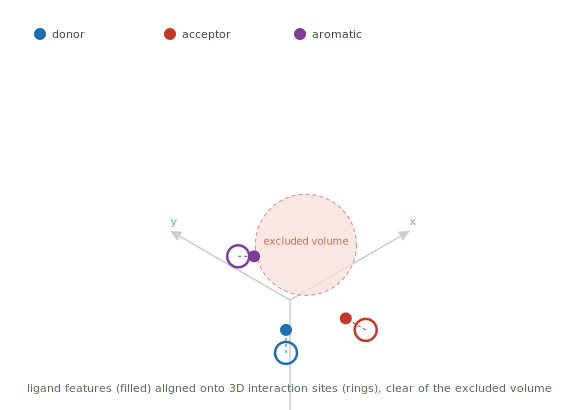
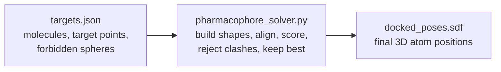
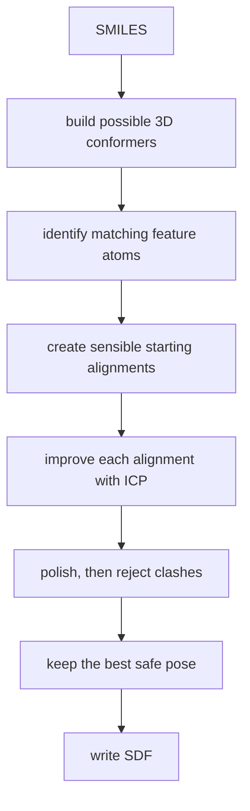
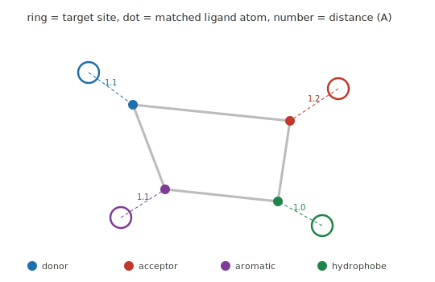
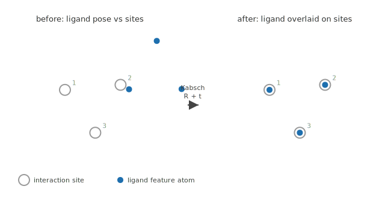
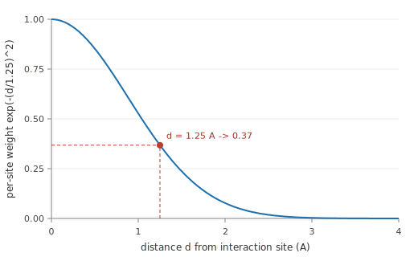
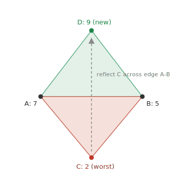
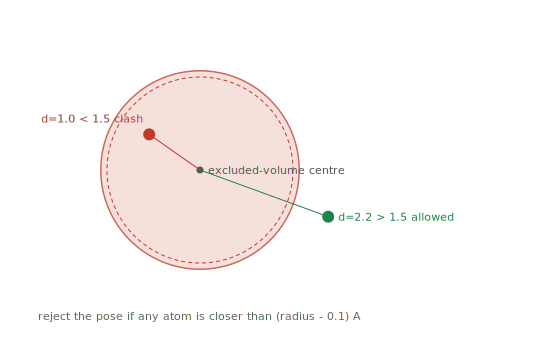

# geometric-pharmacophore-alignment

[](https://github.com/Sebuliba-Adrian/geometric-pharmacophore-alignment/actions/workflows/ci.yml)
[](https://github.com/Sebuliba-Adrian/geometric-pharmacophore-alignment/actions/workflows/ci.yml)
[](https://www.python.org/downloads/)
[](https://github.com/astral-sh/ruff)
[](Dockerfile)

This program places molecules into 3D target patterns.

For each target, it:

1. builds several possible 3D shapes of the molecule;
2. moves and rotates each shape toward matching interaction points;
3. rejects placements that enter forbidden regions;
4. keeps the highest-scoring safe placement; and
5. writes the final 3D atom coordinates to one SDF file.

The complete solver is in `pharmacophore_solver.py`.

## The idea in plain English

Imagine a poseable toy and several coloured dots floating in a room.

- Each dot asks for a certain kind of toy part: for example, a hand, foot, or head.
- The closer the correct part gets to its matching dot, the more points you earn.
- Invisible bubbles are also floating in the room. No part of the toy may enter them.
- The toy may have several possible bends, but each bend is moved as one solid object.

In this task:

- the **toy** is the ligand molecule;
- a **bend** is a conformer: one possible internal 3D shape of the molecule;
- the **coloured dots** are typed pharmacophore interaction sites;
- the **invisible bubbles** are excluded-volume spheres; and
- the final moved-and-rotated placement is the molecule's pose.

The program is therefore solving:

> Which molecular shape should be used, and where should that shape be placed, to
> score as highly as possible without entering a forbidden sphere?

The whole scene at a glance: the solver slides and rotates the ligand so its feature
atoms (filled dots) sit on the matching interaction sites (rings), while staying clear
of the excluded volume (dashed sphere).



## Input and output



### Input

The default input is `/root/data/targets.json`. Each target contains:

- `smiles`: a text description of the atoms and bonds. It describes connectivity,
  but does not provide the final 3D coordinates.
- `interaction_sites`: 3D points the molecule should approach. Every site has:
  - a family: `Donor`, `Acceptor`, `Hydrophobe`, or `Aromatic`;
  - an `(x, y, z)` position; and
  - a weight telling the solver how important that site is.
- `excluded_volumes`: forbidden spheres, each with an `(x, y, z)` centre and a
  radius.

In one sentence: the input says, "Here is the molecule, here are the matching spots
it should approach, and here are the regions it must avoid."

### Output

The default output is `/root/results/docked_poses.sdf`.

It contains one molecule record per target, in the original target order. Each
record contains:

- the same heavy atoms and bonds as the input molecule;
- the final `(x, y, z)` position of every atom;
- the target name; and
- the score reported by the solver.

The grader reads those saved coordinates, checks the forbidden spheres, and
recalculates the score. The tests also read the SDF back from disk and perform these
checks.

### Why SDF?

SMILES describes atoms and bonds but does not store a complete 3D pose. A plain XYZ
file stores coordinates but normally omits chemical bonds and useful molecule
metadata. SDF stores the molecular structure, 3D coordinates, and properties
together, so it is a suitable submission format.

## Setup

```bash
uv venv --python 3.11 .venv
uv pip install --python .venv/bin/python -r requirements.txt
```

## Run

```bash
# Grader paths are the defaults:
# /root/data/targets.json -> /root/results/docked_poses.sdf
.venv/bin/python pharmacophore_solver.py

# Local run with explicit paths
TARGETS_JSON=~/Downloads/targets.json OUTPUT_SDF=./out.sdf \
    .venv/bin/python pharmacophore_solver.py
```

### Docker

```bash
docker build -t pharmacophore .
docker run --rm \
    -v "$PWD/data:/root/data" \
    -v "$PWD/results:/root/results" \
    pharmacophore
```

## Test

```bash
.venv/bin/python -m pytest -q
```

The test suite contains 25 tests covering feature detection, geometry, scoring,
clash checks, determinism, topology preservation, and the written SDF.

## Results

For each target:

```text
percentage = achieved score / sum of all site weights
```

Every emitted pose is clash-free. The score reported by the solver is also checked
against the molecule read back from the output SDF, so the table represents what the
grader sees.

| target | molecule | score |
|--------|----------|------:|
| target_1 | ibuprofen | 89.0% |
| target_2 | caffeine | 50.1% |
| target_3 | aspirin | 67.5% |
| target_4 | imatinib-like | 66.1% |
| target_5 | gefitinib-like | 65.3% |
| **total** | | **66.4%** |

## Small maths toolkit

The solver mostly uses school mathematics applied in three dimensions. The symbols
may look unfamiliar at first, but each one represents an ordinary calculation.

### A 3D point is just three number lines

The point `(2, 3, 1)` means:

- move 2 units along the x-axis;
- move 3 units along the y-axis;
- move 1 unit along the z-axis.

The same three numbers can be called a **point** when they describe a location or a
**vector** when they describe a movement.

For example, translating a point by the vector `(-1, 2, 0)` means adding matching
components:

```text
old point       = ( 2, 3, 1)
movement        = (-1, 2, 0)
new point       = ( 1, 5, 1)
```

In NumPy, adding one `(3,)` translation vector to an `(N, 3)` coordinate table
performs this same three-number addition for every atom.

### Distance is 3D Pythagoras

For points `A = (1, 2, 3)` and `B = (4, 6, 3)`:

```text
change in x = 4 - 1 = 3
change in y = 6 - 2 = 4
change in z = 3 - 3 = 0

distance = √(3² + 4² + 0²)
         = √25
         = 5
```

That is all `np.linalg.norm(A - B)` calculates here. When NumPy receives many atoms,
it repeats this Pythagorean calculation row by row.

### Mean and weighted mean are balance points

The ordinary mean of points `(0, 0)` and `(4, 0)` is their midpoint:

```text
mean = ((0 + 4) / 2, (0 + 0) / 2) = (2, 0)
```

A weighted mean behaves like a balance point with unequal masses. If the first point
has weight 1 and the second has weight 3:

```text
weighted x = (1×0 + 3×4) / (1 + 3) = 3
weighted y = (1×0 + 3×0) / (1 + 3) = 0
```

The result `(3, 0)` lies closer to the more important point. Weighted Kabsch uses
this idea when high-weight interaction sites should influence the alignment more.

### Squaring has two useful jobs

Squaring removes signs and gives larger mistakes more influence:

```text
small miss: 0.5² = 0.25
large miss: 2.0² = 4.00
```

A miss four times as large contributes sixteen times the squared error. This is why
squares appear in RMSD, Kabsch alignment, the Gaussian score, and clash penalties.

### NumPy notation translated into ordinary arithmetic

The solver uses NumPy to perform familiar calculations on many atoms at once:

| NumPy expression | Pencil-and-paper meaning |
|---|---|
| `A - B` | subtract matching coordinates |
| `coords + t` | add the translation `(tx, ty, tz)` to every atom |
| `x ** 2` | square `x` |
| `np.sqrt(x)` | take the square root of `x` |
| `np.mean(coords, axis=0)` | separately average every x, every y, and every z |
| `np.linalg.norm(v)` | calculate `√(vx² + vy² + vz²)` |
| `np.min(values)` | choose the smallest value |
| `np.exp(x)` | calculate `eˣ` |
| `P.T` | swap matrix rows and columns |
| `A @ B` | matrix multiplication |
| `[:, None, :]` | temporarily add a dimension so NumPy can compare every item with every other item |

For example:

```python
np.linalg.norm(atoms - site, axis=1).min()
```

means:

```text
for every matching atom:
    subtract the site's (x, y, z)
    use 3D Pythagoras to find the distance
choose the smallest of those distances
```

`axis` tells NumPy which direction of a table to combine. For an `(N, 3)` atom
table, `axis=1` works across each atom's three coordinates, while `axis=0` works
down all atoms and produces one result for x, one for y, and one for z.

## How the solver works

The full pipeline is:



### 1. Build possible molecular shapes

A SMILES string is like a connectivity recipe: it says which atoms are joined, but
not exactly how a flexible molecule is bent in 3D.

RDKit ETKDG generates several conformers. A conformer changes the molecule's
internal shape by rotating suitable bonds. It does not change which atoms are
connected.

After a conformer is generated, alignment treats it as a rigid object. The solver
may slide it and rotate it, but it does not bend that conformer during the rigid
alignment step.

### 2. Identify useful atom types

RDKit marks atoms that can act as donors, acceptors, hydrophobes, or members of
aromatic features.

A site only scores against atoms from the matching family. An acceptor site, for
example, does not score against a hydrophobic atom.



### 3. Create informed starting poses

Blindly trying every position and rotation would be far too expensive. Instead, the
solver chooses small groups of compatible ligand atoms and target sites whose
internal distances are similar.

This works because moving and rotating a rigid object cannot change the distances
between its atoms. If two ligand atoms are 3 Å apart but their proposed target sites
are 10 Å apart, that proposed match cannot fit and is skipped.

Think of a rigid 3-4-5 cardboard triangle. You may pick it up, turn it, and move it,
but its side lengths remain 3, 4, and 5. It cannot be placed exactly onto a target
triangle whose sides are 3, 4, and 10 without bending or breaking it.

### 4. Align paired points with weighted Kabsch

Once the solver has proposed atom-to-site pairs, the weighted Kabsch algorithm finds
the rotation and translation that place those paired points as close together as
possible.



The key transform is:

```text
new_point = rotation_matrix × old_point + translation_vector
```

- A point is a vector such as `(x, y, z)`.
- The `3 × 3` rotation matrix spins the point without stretching the molecule.
- The translation vector slides the rotated point through space.

Here is a pencil-and-paper 2D version. A 90° anticlockwise rotation uses:

```text
rotation matrix = [ 0  -1 ]
                  [ 1   0 ]

old point = (2, 1)

new x = 0×2 + (-1)×1 = -1
new y = 1×2 +    0×1 =  2

rotated point = (-1, 2)
```

If the translation is `(4, 3)`, add it afterwards:

```text
(-1, 2) + (4, 3) = (3, 5)
```

The real code performs the same arithmetic with a `3 × 3` matrix and `(x, y, z)`.
`coords @ R.T + t` means: rotate every coordinate row, then add the translation.

#### What Kabsch minimises

Suppose three ligand points are paired with three target points. After applying a
candidate rotation and translation, their remaining distances are:

```text
0.2 Å, 0.5 Å, 1.0 Å
```

Their sum of squared errors is:

```text
0.2² + 0.5² + 1.0² = 0.04 + 0.25 + 1.00 = 1.29
```

This example gives all three pairs equal importance. Kabsch finds the allowed rigid
rotation and translation that make the total as small as possible; weighted Kabsch
multiplies each squared error by its pair's weight first. It uses centring, a
`3 × 3` relationship matrix, and
singular value decomposition (SVD) to calculate the answer directly instead of
trying thousands of angles.

The implementation's main pencil-and-paper steps are:

```text
1. Find the weighted centre of each point set.
2. Subtract each centre so both shapes sit around the origin.
3. Summarise how their x, y, and z directions relate in a 3 × 3 matrix.
4. Use SVD to separate that relationship into clean perpendicular directions.
5. Build the best proper rotation, rejecting a mirror reflection.
6. Translate the rotated source centre onto the target centre.
```

SVD is the one step a person would normally let a calculator or library perform,
just as a student usually uses a calculator for square roots. The surrounding
arithmetic can still be followed by hand.

Kabsch is exact for the particular pairs it is given. It does not decide whether
those pairs are globally the best ones.

### 5. Improve the pairs with ICP

ICP means Iterative Closest Point. It repeats two simple actions:

1. match each target site to the nearest currently placed atom of the correct family;
2. run Kabsch again using those updated pairs.

The loop stops when the pairs stop changing. This produces a locally stable
alignment, but not a proof of the globally best pose.

A small example:

```text
Site S has two matching atoms nearby.

Before movement:
distance(S, atom A) = 1.4 Å
distance(S, atom B) = 2.1 Å

ICP chooses atom A, aligns all chosen pairs with Kabsch, then measures again.

After movement:
distance(S, atom A) = 0.6 Å
distance(S, atom B) = 0.9 Å

Atom A is still nearest. If every site's chosen atom also remains unchanged,
the correspondence has stabilised and ICP stops.
```

### 6. Measure pose quality with the real objective

An objective function converts a candidate pose into one number that an optimiser
can compare. It is the program's mathematical definition of "better."

For each interaction site, the solver finds the nearest matching atom at distance
`d` and calculates:

```text
site_score = weight × exp(-(d / 1.25)²)
```

Intuition:

- at `d = 0`, the atom is exactly on the site and receives the full weight;
- as `d` grows, the score falls smoothly;
- a larger weight makes that site more important; and
- the total pose score is the sum of all site scores.

This bell-shaped falloff is called a Gaussian. It rewards close matches strongly
without creating a sudden score jump at one arbitrary distance.



`exp(x)` means the exponential function `eˣ`, where `e ≈ 2.718`. A calculator
normally evaluates it. The important part is how its input changes with distance.

For a site with weight `2`:

| nearest distance `d` | calculation | site score |
|---:|---|---:|
| `0 Å` | `2 × exp(0)` | `2.000` |
| `0.5 Å` | `2 × exp(-(0.5/1.25)²)` | about `1.704` |
| `1.25 Å` | `2 × exp(-1)` | about `0.736` |
| `2.5 Å` | `2 × exp(-4)` | about `0.037` |

So a site gives full credit at zero distance, useful partial credit nearby, and
almost no credit far away.

For several sites, ordinary addition produces the objective score:

```text
donor site score      = 1.70
acceptor site score   = 0.74
aromatic site score   = 0.90
--------------------------------
total pose score      = 3.34
```

The solver gives each site its own nearest matching atom. Two sites are allowed to
choose the same atom because that is how the task's score is defined.

### 7. Polish the pose with Nelder-Mead

Kabsch optimises point-pair distance, but the task's real score is the weighted
Gaussian formula above. The two goals are related, but they are not identical.

The solver therefore gives the Kabsch/ICP result to SciPy's Nelder-Mead optimiser.
Nelder-Mead adjusts six numbers:

```text
rotation_vector_1, rotation_vector_2, rotation_vector_3,
translation_x, translation_y, translation_z
```

The first three numbers together describe one 3D rotation; they are not three
separate rounds of Euler-angle rotation.

You can picture the objective value as the height of a landscape. Each possible set
of six movement numbers is one location on that landscape. A higher score is a
higher location.

An objective is simply the answer to: "What single number will we use to compare two
attempts?" In a different problem it could be travel time, cost, test error, or
profit. Here it is:

```text
objective to minimise = -pharmacophore score + clash penalty
```

SciPy's optimiser minimises numbers. Negating the score reverses its order:

```text
pose A: score 8 -> -score = -8
pose B: score 5 -> -score = -5

-8 is smaller than -5, so minimising -score correctly prefers pose A.
```

This negative sign does not change the chemistry. It only translates "make the score
larger" into the optimiser's language of "make the objective smaller."

Nelder-Mead cannot see the whole landscape. It places a small geometric shape
called a simplex around the current region, evaluates the objective at the simplex
corners, replaces poor corners with more promising ones, and gradually moves and
shrinks the simplex toward a nearby good solution.

In two variables the simplex is a triangle with three corners. Suppose the corners
score `A = 7`, `B = 5`, `C = 2`. `C` is the worst, so the algorithm reflects it across
the opposite edge (A-B) to a trial point `D`. If `D` scores `9`, it replaces `C`, and
the triangle has "walked" uphill toward the better region:



| corner | score before | score after |
|---|---:|---:|
| A | 7 | 7 |
| B | 5 | 5 |
| C | 2 | replaced |
| D | (none) | 9 |

Repeating that compare-and-replace step moves and shrinks the triangle toward a
nearby high-scoring region.

In this solver there are six variables, so the simplex has seven corners. We cannot
draw that shape easily, but the compare-and-replace idea is identical.

Why does two-variable Nelder-Mead start with a triangle? One point only tells us one
height. Two points let us compare along one line. Three non-collinear points sample
a small area, so the algorithm can tell which side appears more promising. For `n`
variables, the equivalent minimal shape needs `n + 1` corners.

Nelder-Mead exists for problems where a score can be calculated but a useful
derivative is unavailable, unreliable, or inconvenient. That fits this objective:
the nearest matching atom can switch abruptly, and clash handling also makes the
landscape less friendly to ordinary gradient methods.

### 8. Handle forbidden spheres

During polishing, a smooth penalty makes penetrating an excluded sphere
unattractive. A penalty helps the optimiser move back toward safe space.

The penalty alone is not the safety guarantee. After optimisation, the solver runs
a strict clash check:

```text
clash if atom-to-centre distance < sphere radius - 0.1 Å
```

Any candidate that fails this hard check is rejected.



For a sphere of radius `1.2 Å`, the allowed tolerance makes the strict boundary:

```text
boundary = 1.2 - 0.1 = 1.1 Å
```

Therefore:

```text
atom distance 0.8 Å: 0.8 < 1.1 -> clash
atom distance 1.1 Å: 1.1 < 1.1 -> false, not a clash
atom distance 1.4 Å: 1.4 < 1.1 -> false, not a clash
```

During polishing, penetration depth is squared. If an atom is `0.3 Å` inside the
boundary, its basic penalty contribution is `0.3² = 0.09`. Deeper penetration costs
more and guides Nelder-Mead outward.

### 9. Search from several starting points

Kabsch, ICP, and Nelder-Mead are local methods: their answer depends on where they
start. The solver therefore tries multiple deterministic conformers and starting
alignments, removes near-duplicate candidates, and keeps the best safe result.

This is a reproducible best-of-many heuristic. It does not prove that the global
maximum has been found.

## Why the search is practical

Two filters avoid wasting most of the runtime:

- **Geometric pruning:** impossible atom/site triples are discarded before Kabsch.
- **Pose deduplication:** poses with nearly identical output coordinates are grouped
  so polishing is spent on different possibilities rather than copies of one pose.

The coordinate RMSD used for this comparison is:

```text
RMSD = √(mean of the squared distance moved by each atom)
```

If three corresponding atoms differ by `0 Å`, `1 Å`, and `2 Å`:

```text
RMSD = √((0² + 1² + 2²) / 3)
     = √(5/3)
     ≈ 1.29 Å
```

RMSD turns many atom-by-atom differences into one typical-distance number.

## How the approach evolved

1. **Brute-force movement:** try a grid of translations and rotations.
   This became impractical because rigid placement already has six variables, and a
   useful grid would require too many combinations.

2. **Kabsch alignment:** calculate the best rigid transform once atom/site pairs are
   chosen. This removed the need to search rotations blindly, but good pairs still
   had to be found.

3. **ICP refinement:** update nearest compatible pairs and rerun Kabsch. This
   improved local correspondence, but it still optimised distance rather than the
   task's exact score.

4. **Nelder-Mead polishing:** optimise the actual weighted Gaussian objective and
   discourage clashes. A final hard check still remained necessary.

5. **Per-atom consistency:** score the exact heavy-atom representation written to
   the SDF. This keeps the in-memory, reported, and on-disk scores consistent.

6. **Multi-start search:** repeat from several deterministic shapes and placements,
   then keep the best valid result. This reduces dependence on one local optimum.

## Important design decisions

- **Conformers handle flexibility.** Different conformers represent different
  internal bends. Rigid translation and rotation then place each conformer in the
  target.
- **Scoring is per atom.** Each site's distance is measured to the nearest matching
  ligand atom, as required by the task.
- **Heavy atoms are used consistently.** Hydrogens help RDKit build sensible 3D
  geometry, then are removed before feature detection, scoring, and output.
- **The clash rule is strict.** Smooth penalties guide the optimiser; the final hard
  distance check decides whether a pose may be emitted.
- **Randomness is controlled.** Fixed seeds make conformer generation and search
  reproducible.
- **The method is heuristic.** Passing every validation check proves output
  consistency and clash freedom, not global optimality.

## Limitations and possible improvements

The score reached by this solver is not a proven upper bound. A molecule may have a
better conformer or pose that the finite search did not sample.

Likely improvements are:

- generate a larger but still diverse set of low-energy conformers;
- refine selected rotatable bonds after rigid placement;
- polish more distinct candidates or use additional perturbed restarts; and
- compare other global-search strategies while preserving the same final checks.

Better search is preferable to loosening chemical feature definitions, because the
output should match the grader's chemical interpretation.

## Glossary

- **Ligand:** the molecule being placed into the target pattern.
- **Pharmacophore:** an abstract 3D pattern of chemical features that a ligand should
  match.
- **Interaction site:** a weighted 3D target point for one chemical feature family.
- **Excluded volume:** a forbidden 3D sphere that ligand atoms must not enter.
- **Conformer:** one internal 3D shape of a molecule; atoms and bonds stay the same,
  but rotatable bonds may have different angles.
- **Pose:** one conformer's position and orientation in the target coordinate system.
- **Translation:** sliding an object in space without turning it.
- **Rotation:** turning an object without changing its shape or size.
- **Vector:** an ordered list of numbers, such as the 3D point `(x, y, z)`.
- **Matrix:** a rectangular table of numbers; here, a `3 × 3` matrix performs a 3D
  rotation.
- **Kabsch algorithm:** calculates the best rigid rotation and translation for known
  pairs of points.
- **ICP:** repeatedly updates nearest point pairs and reruns rigid alignment.
- **Objective function:** the formula that converts one candidate solution into one
  number representing how good or bad it is.
- **Nelder-Mead:** a derivative-free local optimiser that compares the corners of a
  moving simplex.
- **Simplex:** the smallest cornered shape for a given number of variables: a line
  segment in one variable, a triangle in two, and a tetrahedron in three.
- **Gaussian:** the smooth bell-shaped falloff `exp(-(d / scale)²)`.
- **RMSD:** root-mean-square deviation, a summary of average point-pair distance
  error.
- **Local optimum:** a result better than nearby alternatives, though a better
  distant result may exist.
- **Global optimum:** the best result anywhere in the entire search space.
- **Random seed:** a fixed starting number that makes pseudo-random work repeatable.
- **SDF:** a molecular file format that stores atoms, bonds, coordinates, and
  properties.
- **Ångström (Å):** a unit commonly used for atomic distances; `1 Å = 10⁻¹⁰ m`.

## References

- RDKit documentation: <https://www.rdkit.org/docs/>
- SMILES and RDKit background (video reference used while learning the domain):
  <https://www.youtube.com/watch?v=9Z9XM9xamDU>
- Kabsch, W. "A solution for the best rotation to relate two sets of vectors."
  *Acta Crystallographica Section A* 32 (1976).
- Hunter Heidenreich, "Kabsch Algorithm: NumPy, PyTorch, TensorFlow, and JAX":
  <https://hunterheidenreich.com/posts/kabsch-algorithm/>
